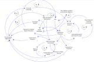
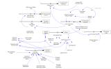
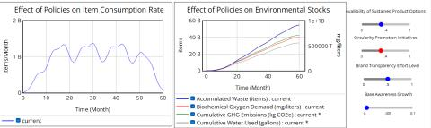

# A System Dynamics Approach to Fast Fashion

A Vensim system dynamics model of the fast-fashion industry, built to identify leverage points for policy intervention in consumer demand, resource consumption, and environmental impact.

## Problem statement

> How do the interconnected systemic dynamics within the fast fashion industry, driven by consumer behavior and influenced by existing policy interventions, contribute to environmental degradation — and what alternative, holistic systems-based interventions can be identified and evaluated to more effectively mitigate these impacts?

## Approach

The fast-fashion industry (SHEIN, Temu, Zara, and others) contributes an estimated 8–10% of global GHG emissions, consumes roughly 93 billion m³ of water annually, and generates 92 million tons of textile waste — driven by ultra-low prices and condensed production cycles. The model links three interacting systems:

- **Consumer adoption** — modeled via the Bass diffusion process (advertising, contact rate, and word-of-mouth driving adoption over time), rather than treating demand as static
- **Item consumption rate** — how adoption translates into actual purchasing behavior
- **Environmental impact stocks and flows** — GHG emissions, water usage/pollution, and waste generation, accumulating as a function of the above

Demographic assumptions are benchmarked to the EU market (ages 18–35, ~€1,500 median income, 3–4 purchases/month), using Inditex as an industry proxy. Current sustainability policies (brand transparency, circularity initiatives, sustainable product options) are modeled explicitly and evaluated for effectiveness rather than assumed to work.

## Model structure

## Key findings

- Consumer adoption dynamics have a significant impact on the overall environmental load within the next 4 years
- Current fast-fashion sustainability policies are inefficient at reducing waste generation
- Policies focused on **extending average item lifespan** and **enhancing consumer awareness** are the most effective levers for reducing average GHG emissions
- Average consumption rate per adopter and word-of-mouth adoption are identified as the critical drivers of overall system behavior

## Files

- [`finalprojectenvfile.mdl`](finalprojectenvfile.mdl) — the Vensim system dynamics model (stocks, flows, and causal structure)
- [`Fast_Fashion_Analysis.pdf`](Fast_Fashion_Analysis.pdf) — the full written analysis, literature review, and results

## Stack

Vensim (system dynamics simulation) · Bass diffusion modeling
